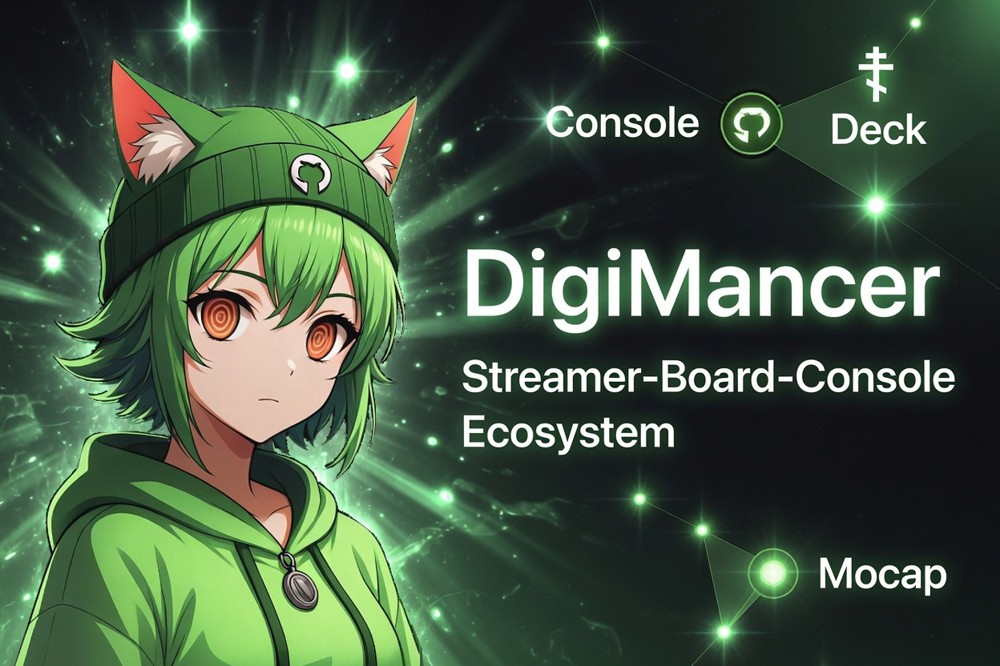
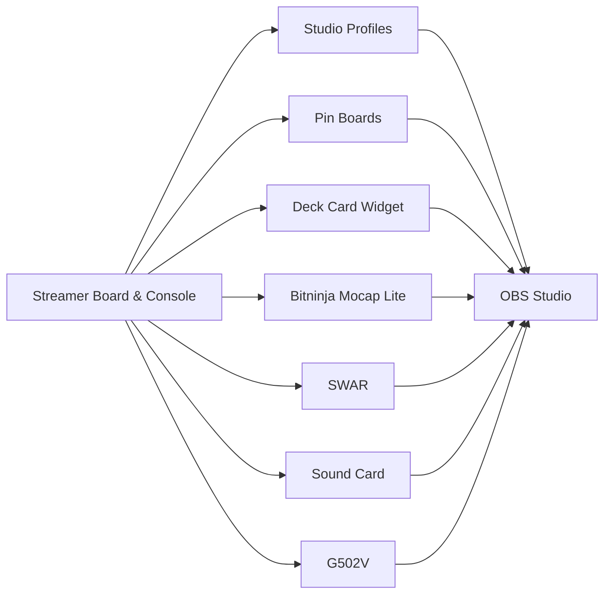
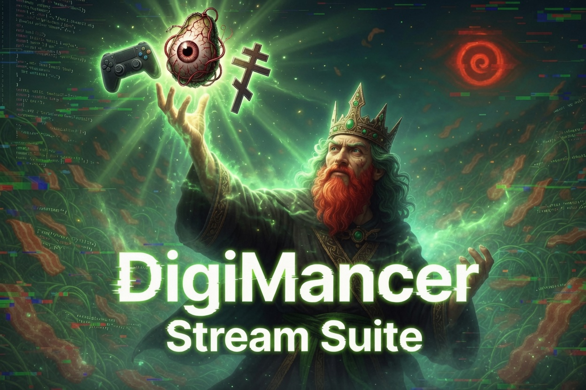

<div align="center">

# DigiMancer Stream

### The unified project hub for the DigiMancer Streamer Tools

**One console. Independent tools. One coordinated stream workflow.**


**Low-resource • Local-first • OBS-friendly • VTuber-ready • Extensible**

</div>

<p align="center">
  
</p>

---

<p align="center">
  <a href="#about-digimancer-stream">About</a> •
  <a href="#the-tool-suite">Tool Suite</a> •
  <a href="#installation-guide">Installation</a> •
  <a href="#connect-the-apps-to-streamer-board-console">Console Setup</a> •
  <a href="#conceptual-stream-workflow">Stream Workflow</a> •
  <a href="#obs-source-plan">OBS Setup</a>
</p>

---

## About DigiMancer Stream

**DigiMancer Stream**, or **DMST**, is the parent project hub for a collection of local streamer tools created under the DigiMancer3D ecosystem.

This repository helps creators:

* Discover the complete tool collection.
* Understand what each application does.
* Install the applications in a practical order.
* Connect them through Streamer Board & Console.
* Build reusable streaming profiles and OBS scenes.
* Keep each application independent and replaceable.

At the center of the ecosystem is **Streamer Board & Console**, a lightweight desktop control hub that can launch, close, restart, pause, monitor, and group companion applications into reusable Studio Profiles.

> [!IMPORTANT]
> DMST is the documentation and discovery hub.
> The applications remain in their own repositories and retain their own installation process, user data, release history, and license.

The ecosystem is designed around four principles:

| Principle        | Meaning                                                                         |
| ---------------- | ------------------------------------------------------------------------------- |
| **Local-first**  | Your tools, models, scripts, cards, and settings remain on your computer.       |
| **Low-resource** | Small native desktop applications are preferred over large all-in-one runtimes. |
| **OBS-friendly** | Visual tools expose dedicated windows that can be captured and arranged in OBS. |
| **Modular**      | Every application can run independently or through Streamer Board & Console.    |

---

## The Tool Suite

The applications are listed below in the recommended installation and setup order.

| Order | Tool                                | Repository                                                                                         | Role                                                                                                                                                                                                                                    |
| :---: | ----------------------------------- | -------------------------------------------------------------------------------------------------- | --------------------------------------------------------------------------------------------------------------------------------------------------------------------------------------------------------------------------------------- |
| **1** | **Streamer Board & Console**        | [DigiMancer3D/Streamer-Board-Console](https://github.com/DigiMancer3D/Streamer-Board-Console)      | Central command console for app adapters, Studio Profiles, Pin Boards, hotkeys, resource monitoring, backups, and coordinated launch actions.                                                                                           |
| **2** | **Deck Card Widget**                | [DigiMancer3D/Deck-Card-Widget](https://github.com/DigiMancer3D/Deck-Card-Widget)                  | Private card controller with a separate OBS output window for claims, sources, questions, labels, emoji, PNG layers, and custom text.                                                                                                   |
| **3** | **Bitninja Mocap Lite**             | [DigiMancer3D/Bitninja-Mocap-Lite](https://github.com/DigiMancer3D/Bitninja-Mocap-Lite)            | Local VTuber motion-capture system derived from SysMocap, with lightweight OBS presets, local VRM loading, and optional HTTP/WebSocket output.                                                                                          |
| **4** | **SWAR :  Script Writer and Reader** | [3DChangesPerspectives/SWAR](https://github.com/DigiMancer3D/3DChangesPerspectives/tree/main/SWAR) | Writer, reader, live preview, Story/Arcs editor, and presentation tool for episode scripts, research notes, cues, and structured documents. SWAR also supports the public [`*.script` format](https://github.com/DigiMancer3D/.script). |
| **5** | **Sound Card**                      | [DigiMancer3D/soundcard](https://github.com/DigiMancer3D/soundcard)                                | Real-time microphone visualizer with a reactive physics blob, vocal frequency bars, custom colors, overlay text, and interactive animations.                                                                                            |
| **6** | **G502V**                           | [DigiMancer3D/G502V](https://github.com/DigiMancer3D/G502V)                                        | Logitech G502 input visualizer with live button lighting, scroll and tilt feedback, configurable mappings, and a mouse-direction indicator.                                                                                             |

You may install the entire suite or use only the applications that fit your show.

---

## How the Ecosystem Fits Together



**Streamer Board & Console** handles orchestration.
The companion applications produce the visuals, controls, mocap, input feedback, cards, and written material used during a stream.

<p align="center">
  
</p>

---

# Installation Guide

## Supported Setup

This guide targets:

* Kubuntu 24 or a similar Ubuntu/Debian desktop.
* X11 or Wayland desktop sessions.
* OBS Studio using Window Capture.
* Python 3 virtual environments.
* A local Node.js/npm installation for Bitninja Mocap Lite.

Other operating systems may require different dependency and launcher steps. Consult the README in each application repository for project-specific information.

---

## Optional: Clone This Hub

Cloning DMST gives you a local copy of this guide and its artwork. It does not install the applications by itself.

```bash
cd ~

git clone https://github.com/DigiMancer3D/DMST.git
cd DMST
```

You may also use this repository entirely through GitHub without cloning it.

---

## Install Common Linux Requirements

Install the shared system packages used by most of the suite:

```bash
sudo apt update

sudo apt install -y \
  git \
  python3 \
  python3-full \
  python3-venv \
  python3-pip \
  python3-tk \
  nodejs \
  npm \
  libportaudio2
```

Individual repositories may require additional packages as their features evolve.

---

# 1. Streamer Board & Console


Repository:

https://github.com/DigiMancer3D/Streamer-Board-Console

Streamer Board & Console should be installed first because it provides the central interface and can obtain the public companion repositories for you.

## Obtain and Install

```bash
cd ~

git clone https://github.com/DigiMancer3D/Streamer-Board-Console.git
cd Streamer-Board-Console

chmod +x \
  install_kubuntu.sh \
  install_desktop_entry.sh \
  install_optional_streamer_apps.sh \
  launch_streamer_board_console.sh \
  launch_streamer_board_console_rescue.sh \
  tools/*.sh \
  tools/*.py

./install_kubuntu.sh
./tools/sbc_selftest.sh
```

The installer creates a local `.venv` inside the console directory and installs the required Python packages.

## Optional Desktop Launcher

```bash
./install_desktop_entry.sh
```

## First Launch

```bash
./launch_streamer_board_console.sh
```

Use the rescue launcher when the normal window opens outside the visible desktop area:

```bash
./launch_streamer_board_console_rescue.sh
```

## Obtain the Companion Applications

From the Streamer Board & Console folder:

```bash
chmod +x install_optional_streamer_apps.sh
./install_optional_streamer_apps.sh
```

The default companion directory is:

```text
~/SBC_Streamer_Apps/
├── Bitninja-Mocap-Lite/
├── Deck-Card-Widget/
├── G502V/
├── soundcard/
└── 3DChangesPerspectives/
    └── SWAR/
```

The helper clones new repositories and attempts to update existing Git repositories. It does not replace each application’s dependency setup, so continue through the following sections in order.

## Initial Console Setup

After opening the console:

1. Open **Apps**.
2. Review the existing app adapters.
3. Open **Adapter Templates** when an adapter must be enabled or recreated.
4. Replace any example path with the actual public clone path on your computer.
5. Verify the launcher or Python entry file.
6. Test each application individually from the Apps tab.
7. Open **Studio Profiles** and create your first show profile.
8. Open **Pin Boards** and create any image boards needed by the show.
9. Use **Dashboard** to watch running status, memory use, CPU use, and process IDs.

> [!WARNING]
> Adapter paths are machine-specific. Do not assume that an example or development path stored in an adapter matches your computer.

---

# 2. Deck Card Widget


Repository:

https://github.com/DigiMancer3D/Deck-Card-Widget

## Obtain Manually

Skip this clone command when the Streamer Board & Console companion installer already obtained the repository.

```bash
mkdir -p ~/SBC_Streamer_Apps
cd ~/SBC_Streamer_Apps

git clone https://github.com/DigiMancer3D/Deck-Card-Widget.git
```

## Install

```bash
cd ~/SBC_Streamer_Apps/Deck-Card-Widget

chmod +x *.sh

./setup_venv_3dcp_console.sh
./doctor_deck_card_widget.sh
./acceptance_deck_card_widget.sh
```

## Launch

```bash
./launch_deck_card_widget_venv.sh
```

A compatibility launcher is also provided:

```bash
./launch_3dcp_console_venv.sh
```

## First-Time Setup

1. Launch the application.
2. Keep the controller window private.
3. Confirm that the separate output window appears.
4. Create a card or load an included template.
5. Configure the top-row labels and dropdown options.
6. Add claim, evidence, question, source, or episode information.
7. Add emoji, PNG, QR, or custom text layers as needed.
8. Save reusable card and deck data.
9. In OBS, add a **Window Capture** source.
10. Select:

```text
Deck Card Widget - Output
```

The default output canvas is designed around:

```text
960 × 500
```

Runtime data is stored under `user_data/`. Do not remove that directory unless you intentionally want to reset local cards, imported images, presets, exports, and runtime settings.

---

# 3. Bitninja Mocap Lite

Repository:

https://github.com/DigiMancer3D/Bitninja-Mocap-Lite

## Obtain Manually

```bash
mkdir -p ~/SBC_Streamer_Apps
cd ~/SBC_Streamer_Apps

git clone https://github.com/DigiMancer3D/Bitninja-Mocap-Lite.git
```

## Install

```bash
cd ~/SBC_Streamer_Apps/Bitninja-Mocap-Lite

npm install

chmod +x run_bitninja_lite_*.sh
```

## Recommended Launch

```bash
./run_bitninja_lite_standard.sh
```

Alternative Linux launchers are available for GPU and desktop compatibility testing:

```bash
./run_bitninja_lite_nvidia_desktopgl.sh
./run_bitninja_lite_nvidia.sh
./run_bitninja_lite_mesa_x11.sh
```

## Add a Local VRM Model

Place VRM models in:

```text
models/
```

Optional model thumbnails belong in:

```text
models/img/
```

Use matching base names:

```text
models/MyModel.vrm
models/img/MyModel.png
```

Then open Bitninja Mocap Lite and select:

```text
Library → Refresh Local VRM Library
```

## First-Time Mocap Setup

1. Select the webcam.
2. Load a local VRM model.
3. Choose a performance preset.
4. Confirm that tracking responds before opening OBS.
5. Position and scale the model.
6. Set the output background.
7. Add the mocap window to OBS with Window Capture.
8. Apply a Color Key filter when using a solid background.

Recommended starting presets:

| Preset         | Recommended Use                                                |
| -------------- | -------------------------------------------------------------- |
| **OBS Fast**   | Gaming, active movement, and the lowest practical stream load. |
| **OBS Smooth** | Discussions, panels, podcasts, and smoother upper-body motion. |
| **Balanced**   | General testing between responsiveness and smoothness.         |
| **Min**        | Lowest-load diagnostic mode.                                   |
| **Face/Hands** | Slower diagnostic mode for face and hand tracking.             |

The default OBS background is:

```text
Hex: #3B2364
RGB: 59, 35, 100
```

Useful mocap controls:

| Key                     | Action                     |
| ----------------------- | -------------------------- |
| `1`                     | Full view                  |
| `2`                     | Half view                  |
| `3`                     | Close view                 |
| `Arrow Up / Arrow Down` | Move model vertically      |
| `Q / E`                 | Rotate model               |
| `0`                     | Center the current view    |
| `L`                     | Toggle the latency display |

---

# 4. SWAR :  Script Writer and Reader


Repository:

https://github.com/DigiMancer3D/3DChangesPerspectives/tree/main/SWAR

SWAR is contained inside the `3DChangesPerspectives` repository.

## Obtain Manually

```bash
mkdir -p ~/SBC_Streamer_Apps
cd ~/SBC_Streamer_Apps

git clone https://github.com/DigiMancer3D/3DChangesPerspectives.git
```

## Install

```bash
cd ~/SBC_Streamer_Apps/3DChangesPerspectives/SWAR

chmod +x \
  install_kubuntu.sh \
  install_desktop_entries.sh \
  install_desktop_identity.sh \
  launch_reader.sh \
  launch_standard.sh \
  run_selftests.sh

./install_kubuntu.sh
./run_selftests.sh
```

## Optional Desktop Integration

```bash
./install_desktop_entries.sh
```

This installs separate desktop launchers for SWAR Standard and SWAR Reader.

## Launch the Writer and Editor

```bash
./launch_standard.sh
```

## Launch Reader Mode

```bash
./launch_reader.sh
```

## First-Time SWAR Setup

Use **SWAR Standard** to:

* Write episode scripts.
* Organize talking points and research.
* Build show sections and source lists.
* Prepare cues and presenter notes.
* Preview formatted output while editing.
* Author Story/Arcs records.
* Export standalone HTML or outlines.

Use **SWAR Reader** to:

* Read a prepared episode during a stream.
* Display formatted notes without exposing editing controls.
* Keep show material in a dedicated, readable window.
* Capture the reader in OBS when the script itself is part of the presentation.

SWAR supports Markdown, plain text, Story/Arcs records, and the public [`*.script` structured writing format](https://github.com/DigiMancer3D/.script).

---

# 5. Sound Card

Repository:

https://github.com/DigiMancer3D/soundcard

## Obtain Manually

```bash
mkdir -p ~/SBC_Streamer_Apps
cd ~/SBC_Streamer_Apps

git clone https://github.com/DigiMancer3D/soundcard.git
```

## Install

```bash
cd ~/SBC_Streamer_Apps/soundcard

python3 -m venv venv
source venv/bin/activate

python -m pip install --upgrade pip
python -m pip install sounddevice numpy
```

## Launch

```bash
cd ~/SBC_Streamer_Apps/soundcard

source venv/bin/activate
python soundcard.py
```

You may also launch directly through the environment interpreter:

```bash
venv/bin/python soundcard.py
```

## First-Time Setup

1. Confirm that the intended microphone or audio source is available.
2. Open the settings panel.
3. Choose the blob, outline, text, and background colors.
4. Adjust vocal gain, compression, and transition behavior.
5. Choose the blob or vocal-bar display.
6. Set a solid background color that can be removed in OBS.
7. Resize the window for the intended scene.
8. Add the **Sound Card** window to OBS.
9. Apply a Color Key filter to remove the background.

Common controls:

| Action                       | Control                                        |
| ---------------------------- | ---------------------------------------------- |
| Poke or launch the blob      | Left-click the blob                            |
| Switch blob/vocal display    | Double-click                                   |
| Move the visual              | `W`, `A`, `S`, `D`                             |
| Open settings                | Gear button                                    |
| Trigger the special power-up | Triple-click the blob or use a vocal collision |
| Close                        | Close button                                   |

Settings are stored in:

```text
soundcard.crumbs
```

---

# 6. G502V


Repository:

https://github.com/DigiMancer3D/G502V

## Obtain Manually

```bash
mkdir -p ~/SBC_Streamer_Apps
cd ~/SBC_Streamer_Apps

git clone https://github.com/DigiMancer3D/G502V.git
```

## Install

```bash
cd ~/SBC_Streamer_Apps/G502V

python3 -m venv venv
source venv/bin/activate

python -m pip install --upgrade pip
python -m pip install pynput

chmod +x g502viz.py
```

## Launch

```bash
cd ~/SBC_Streamer_Apps/G502V

source venv/bin/activate
python g502viz.py
```

Or:

```bash
venv/bin/python g502viz.py
```

## First-Time Setup

1. Launch G502V.
2. Right-click the window or open the menu.
3. Test the primary mouse buttons, scroll wheel, and tilt actions.
4. Open **Edit Mapped Keys**.
5. Use **Detect** to assign custom G502 actions.
6. Configure the mouse-direction indicator.
7. Choose an OBS chroma-key background.
8. Resize and position the visualizer.
9. Add the **G502 Visualizer** window to OBS.
10. Apply a Color Key filter.

`ratbagctl` can optionally be used to inspect compatible mouse profiles. G502V remains usable when `ratbagctl` is unavailable, although automatic device-profile inspection will be limited.

Persistent configuration files include:

```text
settings.crumbs
mappings.json
```

---

# Connect the Apps to Streamer Board & Console

After every application launches successfully on its own, return to Streamer Board & Console.

Open:

```text
Apps → Adapter Templates
```

Use these public clone locations and entries:

| Application         | Recommended Local Path                           | Launch Mode | Entry                                      |
| ------------------- | ------------------------------------------------ | ----------- | ------------------------------------------ |
| Deck Card Widget    | `~/SBC_Streamer_Apps/Deck-Card-Widget`           | Shell       | `launch_deck_card_widget_venv.sh`          |
| Bitninja Mocap Lite | `~/SBC_Streamer_Apps/Bitninja-Mocap-Lite`        | Shell       | `run_bitninja_lite_standard.sh`            |
| SWAR                | `~/SBC_Streamer_Apps/3DChangesPerspectives/SWAR` | Shell       | `launch_reader.sh` or `launch_standard.sh` |
| Sound Card          | `~/SBC_Streamer_Apps/soundcard`                  | Venv Python | `soundcard.py`                             |
| G502V               | `~/SBC_Streamer_Apps/G502V`                      | Venv Python | `g502viz.py`                               |

For each adapter:

1. Set the application folder.
2. Set the launch mode.
3. Set the entry file.
4. Save or enable the adapter.
5. Launch it from the Apps tab.
6. Confirm that the Dashboard detects the process.
7. Test Close and Restart.
8. Test Pause and Resume only when appropriate for that application.
9. Add the application to a Studio Profile.

---

## Create a Studio Profile

A Studio Profile defines what the console should do with each application when preparing a show.

Example profile:

```text
Profile: DigiMancer Full Stream

Deck Card Widget       → Launch
Bitninja Mocap Lite    → Launch
SWAR Reader            → Launch
Sound Card             → Launch
G502V                   → Launch
Main Pin Board          → Launch separately from Pin Boards
```

Other useful profiles might include:

| Profile               | Suggested Apps                                       |
| --------------------- | ---------------------------------------------------- |
| **Gaming**            | Bitninja, G502V, Sound Card, Pin Board               |
| **Talk / Podcast**    | Bitninja OBS Smooth, Deck Card Widget, SWAR Reader   |
| **Research Stream**   | Deck Card Widget, SWAR Reader, Pin Boards            |
| **Clean Visuals**     | Bitninja and selected Pin Boards only                |
| **Writing Session**   | SWAR Standard with optional Deck Card Widget         |
| **Emergency Minimal** | Only the applications essential to the current scene |

Each profile can assign actions such as:

* Keep
* Launch
* Close
* Restart
* Pause
* Resume

---

## Configure Pin Boards

Pin Boards are reusable image-board windows managed by Streamer Board & Console.

A conceptual setup process:

1. Open the **Pin Boards** tab.
2. Create a board for the show or scene.
3. Add logos, topic art, PNG elements, references, or temporary visual notes.
4. Set the board size and background.
5. Choose a stable background or chroma-key color.
6. Save the board.
7. Launch the board as an independent window.
8. Add that window to OBS using Window Capture.
9. Use the console to raise, park, restore, or close the board as needed.

Possible board roles:

* Episode title board
* Guest information board
* Topic reference board
* Starting-soon panel
* Break screen element
* Sponsor or link board
* Emergency information panel
* Reusable show branding

---

# Conceptual Stream Workflow

The following method treats the suite as one coordinated production system.

## 1. Launch Streamer Board & Console

```bash
cd ~/Streamer-Board-Console
./launch_streamer_board_console.sh
```

Use the Dashboard to confirm that no stale application processes remain from the previous session.

## 2. Choose or Build a Studio Profile

Open **Studio Profiles** and select the profile for the current type of show.

Examples:

* Gaming
* Talk or podcast
* Research discussion
* Tutorial
* Writing session
* Full DigiMancer stream

Confirm the launch action assigned to every application.

## 3. Launch the Profile

Apply the selected profile and allow the console to start the required applications.

Check the Dashboard for:

* Running status
* Process ID
* RAM use
* CPU use
* Missing or failed launches

## 4. Prepare Deck Card Widget

* Load the episode’s deck.
* Check card order.
* Verify sources and labels.
* Confirm the output window.
* Test switching between cards.
* Leave the private controller outside the captured area.

## 5. Prepare the Pin Boards

* Load the appropriate board.
* Confirm its artwork and dimensions.
* Launch or bring the board into view.
* Test its OBS source.
* Park boards that are not needed immediately.

## 6. Prepare Bitninja Mocap Lite

* Select the avatar.
* Confirm the camera.
* Choose OBS Fast, OBS Smooth, or another preset.
* Center and scale the avatar.
* Test head, body, and mouth response.
* Verify the keyed background in OBS.

## 7. Prepare Sound Card

* Confirm the microphone.
* Check the blob or vocal-bar response.
* Match the background to the OBS key.
* Verify the visual does not cover important scene elements.

## 8. Prepare G502V

* Test mouse buttons and movement.
* Confirm mappings.
* Check the direction indicator.
* Verify the chroma-key result in OBS.

## 9. Prepare OBS

* Confirm every Window Capture source.
* Check cropping and scaling.
* Confirm Color Key filters.
* Lock sources that should not move.
* Test scene changes.
* Check that private controller windows are not captured.

## 10. Prepare the Episode in SWAR

* Open SWAR Standard.
* Write or review the episode.
* Organize topics, transitions, sources, and closing notes.
* Save the document.
* Open it in SWAR Reader.
* Position Reader on the intended monitor.
* Capture Reader only when it is meant to appear in the broadcast.

## 11. Begin the Stream

Streamer Board & Console remains the central operational window.

Use it to:

* Start or stop supporting applications.
* Restart an unresponsive visual.
* Park an application that is temporarily unnecessary.
* Raise a Pin Board.
* Watch resource use.
* Change profile state between show segments.

---

# OBS Source Plan

| Tool                     | Recommended OBS Source                        | Typical Filter                          |
| ------------------------ | --------------------------------------------- | --------------------------------------- |
| Streamer Board Pin Board | Window Capture                                | Color Key when using a keyed background |
| Deck Card Widget         | Window Capture of `Deck Card Widget - Output` | Usually none                            |
| Bitninja Mocap Lite      | Window Capture                                | Color Key                               |
| SWAR Reader              | Window Capture                                | Optional crop                           |
| Sound Card               | Window Capture of `Sound Card`                | Color Key                               |
| G502V                    | Window Capture of `G502 Visualizer`           | Color Key                               |

> [!TIP]
> Capture output windows rather than private controller windows.
> After positioning an OBS source, lock it to prevent accidental movement.

A practical OBS scene may contain:

```text
Background or game
├── Bitninja Mocap Lite
├── Deck Card Widget
├── Pin Board
├── Sound Card
├── G502V
└── Optional SWAR Reader
```

---

# Updating the Suite

## Update Streamer Board & Console

```bash
git -C ~/Streamer-Board-Console pull --ff-only

cd ~/Streamer-Board-Console
./install_kubuntu.sh
./tools/sbc_selftest.sh
```

## Update the Companion Repositories

The optional companion installer also updates existing Git repositories:

```bash
cd ~/Streamer-Board-Console
./install_optional_streamer_apps.sh
```

After an application update, rerun that application’s installer or dependency command when its README reports changed requirements.

Examples:

```bash
# Deck Card Widget
cd ~/SBC_Streamer_Apps/Deck-Card-Widget
./setup_venv_3dcp_console.sh

# Bitninja Mocap Lite
cd ~/SBC_Streamer_Apps/Bitninja-Mocap-Lite
npm install

# SWAR
cd ~/SBC_Streamer_Apps/3DChangesPerspectives/SWAR
./install_kubuntu.sh
./run_selftests.sh
```

Back up user data before replacing folders manually.

---

# Troubleshooting

## Streamer Board & Console Opens Off-Screen

```bash
cd ~/Streamer-Board-Console
./launch_streamer_board_console_rescue.sh
```

## Console Self-Test

```bash
cd ~/Streamer-Board-Console
./tools/sbc_selftest.sh
```

## Adapter Check

```bash
cd ~/Streamer-Board-Console
./tools/sbc_adapter_doctor.py
```

## Deck Card Widget Check

```bash
cd ~/SBC_Streamer_Apps/Deck-Card-Widget

./doctor_deck_card_widget.sh
./acceptance_deck_card_widget.sh
```

## Bitninja Does Not Start

First confirm that Electron was installed:

```bash
cd ~/SBC_Streamer_Apps/Bitninja-Mocap-Lite
npm install
```

Then try the standard launcher followed by the alternate GPU launchers:

```bash
./run_bitninja_lite_standard.sh
./run_bitninja_lite_nvidia_desktopgl.sh
./run_bitninja_lite_nvidia.sh
./run_bitninja_lite_mesa_x11.sh
```

## A Python App Cannot Find a Module

Activate the application’s own environment before launching it:

```bash
source venv/bin/activate
```

Then reinstall its dependencies.

Sound Card:

```bash
python -m pip install sounddevice numpy
```

G502V:

```bash
python -m pip install pynput
```

## An App Works Manually but Not Through the Console

Check:

1. The adapter’s application path.
2. The adapter’s entry file.
3. The selected launch mode.
4. File execute permissions.
5. Whether the application has its required virtual environment or `node_modules`.
6. Whether the application is already running under another process.
7. The console logs and Adapter Doctor output.

---

# Data and Backups

Each application keeps its own runtime information.

Important examples include:

| Application              | Important Local Data                                       |
| ------------------------ | ---------------------------------------------------------- |
| Streamer Board & Console | `user_data/`, adapters, profiles, boards, app controls     |
| Deck Card Widget         | `user_data/`, saved cards, imported PNGs, presets, exports |
| SWAR                     | `SWAR.udata` and authored documents                        |
| Sound Card               | `soundcard.crumbs`                                         |
| G502V                    | `settings.crumbs`, `mappings.json`                         |
| Bitninja Mocap Lite      | Local models, thumbnails, and application settings         |

Streamer Board & Console includes **Backup / Migrate** tools for its own managed data. Companion-app data should also be backed up before major updates or folder replacement.

Do not publish personal paths, private links, stream keys, tokens, locally authored material, or runtime configuration without reviewing the files first.

---

# Visual Identity

The DigiMancer Stream visual identity includes:

* The green cat-eared VTuber with red spiral eyes.
* The tissue-connected eyeball-avocado pendant.
* Double-bar northern Russian Orthodox crosses without a slanted lower bar.
* Green pin-glows.
* Digital nebula and streamer-laboratory aesthetics.
* A mixture of strange, playful, technical, and occult-digital imagery.

The current hub artwork is stored at the repository root:

```text
Github_group.png
DM3D_group_2.png
```

---

# Project Philosophy

> **Stay local. Stay lightweight. Stay modular. Stay weird: in a good way.**

Every application is intended to remain useful on its own.

Streamer Board & Console does not turn the ecosystem into a mandatory monolith. Instead, it provides optional coordination across independent applications.

That means creators can:

* Install only the tools they need.
* Replace one application without replacing the entire suite.
* Use different profiles for different shows.
* Preserve local control of files and settings.
* Extend the console with additional adapters.
* Build a streaming workflow around their own hardware and style.

---

# Project Links

* **GitHub profile:** [DigiMancer3D](https://github.com/DigiMancer3D)
* **DMST hub:** [DigiMancer3D/DMST](https://github.com/DigiMancer3D/DMST)
* **X / Twitter:** [@Z0M8I3D](https://x.com/Z0M8I3D)
* **Website:** [3Dthe.ninja](https://3Dthe.ninja)

---

# License

This DMST hub repository is released under the **BSD 3-Clause License**.

Each linked application remains governed by the license included in its own repository. Review the applicable repository license before redistributing, modifying, packaging, or combining its code with another project.

---

<div align="center">

### DigiMancer Stream

**Stream tools that talk to each other: without losing their independence.**

</div>
